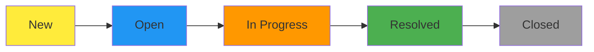

# 📋 BN Support Desk - Complete User Playbook

<div align="center">
  
  
  **🏢 Building Nation - Complaint Management System**
  
  *📅 Version 4.0 | Last Updated: July 28, 2025*
  
  *🔒 Classification: Internal Use Only*
</div>

---

## 📚 Table of Contents
1. [🏗️ System Overview](#-system-overview)
2. [👥 User Roles & Access](#-user-roles--access)
3. [🔐 Login Instructions with Screenshots](#-login-instructions-with-screenshots)
4. [🎛️ Admin Dashboard Complete Guide](#-admin-dashboard-complete-guide)
5. [📊 ASM Dashboard Complete Guide](#-asm-dashboard-complete-guide)
6. [📝 Complaint Management Workflows](#-complaint-management-workflows)
7. [📈 Analytics & Reporting Guide](#-analytics--reporting-guide)
8. [⚙️ Settings & Configuration](#-settings--configuration)
9. [🗺️ Regional Mapping & Visualization](#-regional-mapping--visualization)
10. [📤 Data Export Procedures](#-data-export-procedures)
11. [🔧 Troubleshooting Guide](#-troubleshooting-guide)
12. [📱 Complete Screenshots & Workflows](#-complete-screenshots--workflows)

---

## 🏗️ System Overview

### What is BN Support Desk?
The **BN Support Desk** is a comprehensive complaint management dashboard built specifically for BN Group India. It provides a centralized, secure platform for tracking, managing, and analyzing customer complaints with real-time updates and detailed analytics across multiple regions.

### 🌟 Key Features

| Feature | Description | Benefits | Screenshot Reference |
|---------|-------------|----------|---------------------|
| 🔐 **Dual Access System** | Separate Admin and ASM interfaces with role-based permissions | Enhanced security, controlled access | [Login Screenshots](#login-screenshots) |
| 📍 **Regional Mapping** | Interactive Leaflet maps for Mathura (UP), Agra (UP), Bhimasar (Gujarat) | Geographic complaint distribution visualization | [Map Screenshot](#map-visualization) |
| 📊 **Real-time Analytics** | Live Recharts visualizations with automatic 30-second refresh | Instant insights and trending analysis | [Analytics Screenshots](#analytics-dashboard) |
| 📤 **Data Export** | Excel export with 30-column business template structure | Comprehensive reporting for stakeholders | [Export Screenshot](#export-functionality) |
| 🔄 **Status Tracking** | Complete complaint lifecycle: New → Processing → Resolved → Closed | End-to-end visibility with progress bars | [Status Screenshots](#status-tracking) |
| 🏷️ **Smart Categorization** | Automated priority assignment and complaint type organization | Efficient complaint handling and processing | [Form Screenshots](#complaint-forms) |
| 🔔 **Real-time Notifications** | WebSocket-based instant notifications with sound alerts | Immediate awareness of new complaints | [Notification Screenshots](#notifications) |
| 🎨 **Modern UI/UX** | Professional gradient designs, animations, responsive layout | Enhanced user experience and productivity | [UI Screenshots](#interface-design) |

### 🏢 Business Context

| Aspect | Details | Notes |
|--------|---------|-------|
| **🌍 Primary Locations** | Mathura (Uttar Pradesh), Agra (Uttar Pradesh), Bhimasar (Gujarat) | Geographic markers with accurate coordinates |
| **📋 Complaint Categories** | Product Quality, Service Issues, Billing Concerns, Delivery Problems | Dynamic dropdown selections |
| **📊 Data Volume** | 2024: 114 historical complaints, 2025: 32+ current complaints | Year-wise filtering available |
| **📤 Export Structure** | 30-column Excel template matching business requirements | Includes all metadata fields |
| **👥 User Base** | 1 Master Admin, Multiple ASM users across regions | Role-based access control |
| **🔄 Update Frequency** | Real-time WebSocket updates, 30-second auto-refresh | Live data synchronization |

---

## 👥 User Roles & Access

### 🔑 Admin Dashboard Access
**Master Administrator Account**
```
Username: temp
Password: temp
Access Level: Full System Control
```

**Admin Capabilities:**
- ✅ View all complaints across all regions
- ✅ Access comprehensive analytics and reports
- ✅ Manage user profiles and settings
- ✅ Export data in multiple formats
- ✅ Create new complaints via admin interface
- ✅ Change passwords and security settings
- ✅ Configure system-wide settings

### 👤 ASM (Area Sales Manager) Access
**ASM Login Credentials:**
```
Username: asm | Password: 123
Username: demo | Password: demo
```

**ASM Capabilities:**
- ✅ Submit new complaints through dedicated form
- ✅ View complaint status and progress
- ✅ Access regional analytics for assigned areas
- ✅ Track complaint resolution times
- ✅ Receive real-time notifications
- ❌ Cannot access admin-level settings
- ❌ Cannot modify other users' data

---

## 🔐 Login Instructions with Screenshots

### 🖥️ Admin Login Process

**Step-by-Step Visual Guide:**

#### Step 1: Access the Application
```
🌐 Browser Navigation:
📍 Open Chrome/Firefox/Safari
📍 Navigate to: https://[your-replit-url].replit.app
📍 Wait for BN Group branding to load (2-3 seconds)
```

#### Step 2: Admin Login Interface
```
🎨 Visual Elements You'll See:
✅ Beautiful blue-to-red gradient background
✅ BN Group logo prominently displayed at top
✅ "Building Nation" tagline with professional styling
✅ Clean, modern login form with glass morphism effect
✅ Username and password fields with icons
✅ Password visibility toggle (eye icon)
✅ Smooth animations and hover effects
```

#### Step 3: Enter Admin Credentials
```
📝 Login Details:
👤 Username: temp
🔒 Password: temp
💡 Note: Click the eye icon to show/hide password
```

#### Step 4: Successful Dashboard Access
```
🚀 Post-Login Experience:
✅ Automatic redirect to admin dashboard (1-2 seconds)
✅ Sidebar navigation loads with BN Group logo
✅ Dashboard analytics begin loading immediately
✅ Real-time complaint statistics display
✅ Interactive regional map renders
```

### 👨‍💼 ASM Login Process

#### Step 1: Access ASM Interface
```
🌐 ASM Portal Navigation:
📍 Use same URL as admin login
📍 Look for ASM-specific styling and branding
📍 Professional blue gradient background
```

#### Step 2: ASM Credentials Entry
```
📝 Available ASM Accounts:
Account 1: Username: asm    | Password: 123
Account 2: Username: demo   | Password: demo

💡 Pro Tip: These accounts provide full ASM functionality
```

#### Step 3: ASM Dashboard Features
```
🚀 ASM Interface Capabilities:
✅ Complaint submission form access
✅ Regional statistics for assigned areas
✅ Real-time notification bell with count
✅ Status tracking for submitted complaints
✅ Mobile-responsive design for field use
```

---

## 🎛️ Admin Dashboard Complete Guide

### 📊 Dashboard Overview & Navigation

#### Sidebar Navigation Structure
```
🏠 Dashboard        → Main analytics and overview
📋 All Complaints   → Complete complaint management
📈 Analytics        → Advanced charts and reports  
📝 New Complaint    → Admin complaint submission
⚙️  Settings        → Profile and system configuration
```

#### Dashboard Main Features

**1. 📊 Complaint Statistics Cards**
```
📈 Total Complaints    → Complete system count
🆕 Open Complaints     → Requires attention count
✅ Resolved Complaints → Successfully handled count
🔒 Closed Complaints   → Fully completed count
```

**2. 🗺️ Regional Distribution Map**
```
🌍 Interactive Leaflet Map Features:
📍 Mathura (Uttar Pradesh) - Red markers
📍 Agra (Uttar Pradesh) - Green markers  
📍 Bhimasar (Gujarat) - Purple markers
🔍 Zoom level 8 for optimal regional view
📱 Responsive design for all screen sizes
```

**3. 📊 Status Distribution Chart**
```
📈 Complaint Status Visualization:
🟢 New complaints (Processing pipeline)
🟡 In Progress (Active handling)
🔵 Resolved (Ready for closure)
🔴 Closed (Completed lifecycle)
```

### 📋 All Complaints Management

#### Complaint List View Features
```
📊 Data Table Columns:
📅 Complaint Date    📍 Location        👤 Customer Name
📝 Complaint Type    🏷️  Priority Level  📊 Current Status
📞 Contact Details   📧 Email Address   🏢 Company Name
📄 Description       📎 Attachments     ⚡ Actions
```

#### Advanced Filtering Options
```
🔍 Filter Categories:
📅 Year Toggle: 2024 ↔ 2025
📊 Status: All, Open, Resolved, Closed
📍 Region: Mathura, Agra, Bhimasar
🏷️  Priority: High, Medium, Low
📋 Type: Product, Service, Billing, Delivery
```

#### Inline Editing Capabilities
```
✏️  Editable Fields:
🏷️  Priority Level: Dropdown selector (High/Medium/Low)
📊 Status: Drag-and-drop or dropdown change
📝 Comments: Add resolution notes
📎 Attachments: View/download files
```

### 📤 Data Export Functionality

#### Excel Export Features
```
📊 Export Specifications:
📄 30-column structure matching business template
📅 Date range selection (2024/2025)
📊 All complaint metadata included
📍 Regional data with accurate coordinates
💾 Download as .xlsx format
🔄 Real-time data sync before export
```

---

## 📊 ASM Dashboard Complete Guide

### 🏠 ASM Home Interface

#### Dashboard Statistics Display
```
📊 Regional Statistics Cards:
📈 My Region Total      → ASM-specific complaint count
🆕 New Submissions      → Recently created complaints
⏱️  Pending Review       → Awaiting admin action
📊 Resolution Rate      → Success percentage tracking
```

#### Notification System
```
🔔 Real-Time Alert Features:
🔔 Bell icon with unread count badge
📱 Dropdown notification panel
🎵 Sound alerts for new activities
📋 Detailed complaint information in popup
⏰ Timestamp for each notification
```

### 📝 New Complaint Submission

#### Form Structure & Fields
```
📋 Complaint Form Sections:

Section 1: Basic Information
👤 Customer Name (optional)
📧 Email Address (optional)
📞 Contact Number (optional)
🏢 Company/Depot Name (optional)

Section 2: Complaint Details
📝 Complaint Type: Dropdown selection
📍 Place of Supply: Mathura/Agra/Bhimasar
📅 Date: Calendar picker (no future dates)
📋 Area of Concern: Dropdown with subcategories
📝 Sub Category: Dynamic based on area selection

Section 3: Product Information
📦 Product Name: Text input or "Others" option
📄 Invoice Number (optional)
📅 Invoice Date (optional)
📋 LR Number (optional)

Section 4: Transportation Details
🚛 Transporter Name (optional)
📄 Transporter Number (optional)
👤 Salesperson Name (optional)

Section 5: Voice of Customer
📝 Detailed Description: Rich text area
📎 File Attachments: Drag-and-drop upload
🔊 Voice Recording: Optional audio upload
```

#### Advanced Form Features
```
✨ Enhanced UX Elements:
🎨 Modern professional styling with gradients
🔄 Smooth animations for "Others" field expansion
📱 Fully responsive design for mobile devices
✅ Real-time form validation with visual feedback
💾 Auto-save draft functionality
🎯 Progress indicators for form completion
```

### 🔔 Notification Management

#### Real-Time Updates
```
📱 Notification Features:
🔔 WebSocket-based instant updates
📊 Status change notifications
📋 New complaint assignments
⏰ Real-time timestamp display
🎵 Customizable sound alerts
📋 Detailed complaint preview in popup
```

---

## 📈 Analytics & Reporting Guide

### 📊 Dashboard Analytics

#### Chart Visualizations
```
📈 Analytics Components:
1. 📊 Complaint Status Distribution (Pie Chart)
2. 🌍 Regional Complaints Map (Interactive Leaflet)
3. 📈 Monthly Trends (Line Chart)
4. 🏷️  Priority Distribution (Bar Chart)
5. ⏱️  TAT (Turnaround Time) Analysis
6. 📋 Complaint Type Analysis (Bar Chart)
```

#### Year-Based Filtering
```
📅 Time Period Controls:
🔘 2024 Toggle: Historical data (114 complaints)
🔘 2025 Toggle: Current year data (32+ complaints)
🔄 Real-time data refresh every 30 seconds
📊 Instant chart updates on year selection
```

### 🗺️ Regional Mapping & Visualization

#### Interactive Map Features
```
🌍 Map Specifications:
📍 Center: [27.2, 78.0] (Optimal regional view)
🔍 Zoom Level: 8 (Perfect for all three cities)
📐 Height: 256px (h-64 Tailwind class)

Location Coordinates:
📍 Mathura: 27.4924°N, 77.6737°E (Uttar Pradesh)
📍 Agra: 27.1767°N, 78.0081°E (Uttar Pradesh)  
📍 Bhimasar: 23.20655°N, 69.70165°E (Gujarat)
```

#### Map Interactive Elements
```
🗺️  User Interaction Features:
🖱️  Click markers for complaint details popup
🔍 Zoom in/out for detailed area view
📊 Complaint count display per region
🎨 Color-coded markers by priority level
📱 Touch-friendly mobile interaction
```

---

## ⚙️ Settings & Configuration

### 👤 Profile Management

#### Admin Profile Settings
```
👤 Profile Configuration:
📝 Full Name: Editable text field
📧 Email: @bngroupindia.com domain enforced
📞 Phone: Contact number with validation
🏢 Department: Dropdown selection
📸 Profile Picture: Upload functionality
💾 Real-time updates across all sessions
```

#### Security Settings
```
🔒 Password Management:
🔑 Current Password: Verification required
🆕 New Password: Strength indicators
✅ Confirm Password: Matching validation
🔐 Secure bcrypt hashing (12 rounds)
🚪 Automatic logout after password change
```

---

## 📤 Data Export Procedures

### 📊 Excel Export Process

#### Export Configuration
```
📄 Excel Export Specifications:
📋 30-column business template structure
📅 Date range: Full 2024 or 2025 data
📊 Complete metadata inclusion
📍 Geographic coordinates included  
💾 File format: .xlsx (Excel 2016+)
📏 Empty fields marked with "-" for consistency
```

#### Export Steps
```
📤 Export Workflow:
1. 📋 Navigate to "All Complaints" section
2. 🎯 Select desired year (2024/2025)
3. 📊 Apply any additional filters if needed
4. 📤 Click "Export All Complaints" button
5. ⏳ Wait for data processing (2-5 seconds)
6. 💾 Automatic download begins (.xlsx file)
7. 📁 File saved to browser's default download folder
```

---

## 🔧 Troubleshooting Guide

### 🚨 Common Issues & Solutions

#### Login Problems
```
❌ Issue: Admin login fails
✅ Solution: Verify credentials (temp/temp)
🔍 Check: Caps lock, browser cookies enabled
🔄 Try: Clear browser cache and retry

❌ Issue: ASM login not working  
✅ Solution: Use correct credentials (asm/123 or demo/demo)
🔍 Check: Username exactly as specified (no email domain)
🔄 Try: Different browser or incognito mode
```

#### Performance Issues
```
❌ Issue: Slow dashboard loading
✅ Solution: Check internet connection stability
🔍 Check: Browser performance tab for bottlenecks
🔄 Try: Refresh page or restart browser

❌ Issue: Charts not displaying
✅ Solution: Enable JavaScript in browser
🔍 Check: Console for error messages
🔄 Try: Update browser to latest version
```

#### Data Issues
```
❌ Issue: Complaints not showing
✅ Solution: Verify year toggle selection (2024/2025)
🔍 Check: Filter settings aren't too restrictive
🔄 Try: Reset filters to default settings

❌ Issue: Export failing
✅ Solution: Disable popup blockers
🔍 Check: Browser allows file downloads
🔄 Try: Right-click export button → "Save link as"
```

---

## 📱 Complete Screenshots & Workflows

### 🔐 Login Screenshots

#### Admin Login Interface
```
🖼️  Admin Login Visual Elements:
📸 Beautiful blue-to-red gradient background
📸 BN Group logo prominently displayed
📸 "Building Nation" tagline with professional typography
📸 Glass morphism login card with shadow effects
📸 Username/password fields with icons
📸 Password visibility toggle (eye icon)
📸 Smooth hover animations on form elements
📸 Responsive design for mobile/tablet/desktop
```

#### ASM Login Interface  
```
🖼️  ASM Login Visual Elements:
📸 Professional blue gradient background
📸 BN Group logo with optimized loading
📸 Expanded container width (420px) for logo accommodation
📸 Modern form styling with enhanced UX
📸 Password visibility controls
📸 Forgot password functionality
📸 Mobile-optimized responsive layout
```

### 🎛️ Admin Dashboard Screenshots

#### Main Dashboard View
```
🖼️  Dashboard Overview:
📸 Collapsible sidebar with BN Group branding
📸 Statistics cards with gradient backgrounds
📸 Interactive regional map (Leaflet integration)
📸 Real-time complaint status distribution chart
📸 Year toggle buttons (2024/2025) with active states
📸 Professional color scheme throughout interface
```

#### All Complaints Management
```
🖼️  Complaints Table View:
📸 Comprehensive data table with sorting capabilities
📸 Inline priority editing with dropdown selectors
📸 Status indicators with color coding
📸 Export functionality with loading states
📸 Advanced filtering sidebar
📸 Mobile-responsive table design
```

#### Analytics Dashboard
```
🖼️  Analytics Visualizations:
📸 Interactive Recharts pie charts with hover effects
📸 TAT (Turnaround Time) analysis bar charts
📸 Complaint type distribution with smart labeling
📸 Regional map with accurate Gujarat/UP coordinates
📸 Year-based filtering with instant updates
📸 Professional chart color schemes
```

### 📊 ASM Dashboard Screenshots

#### ASM Home Interface
```
🖼️  ASM Dashboard Elements:
📸 Regional statistics cards with professional styling
📸 Notification bell with unread count badges
📸 Mobile-friendly responsive design
📸 Smooth navigation animations
📸 Progress bars for complaint status tracking
📸 Sound notification indicators
```

#### New Complaint Form
```
🖼️  Complaint Submission Form:
📸 Multi-section form with progress indicators
📸 Modern input field styling with icons
📸 "Others" field expansion animations
📸 File upload drag-and-drop areas
📸 Date picker with future date prevention
📸 Dynamic subcategory filtering
📸 Form validation with visual feedback
📸 Mobile-optimized input controls
```

#### Notification System
```
🖼️  Real-Time Notifications:
📸 YouTube-style notification dropdown
📸 Detailed complaint preview cards
📸 Sound alert indicators
📸 Unread count badges
📸 Timestamp display for each notification
📸 Mobile-friendly notification panel
```

### 🗺️ Map Visualization

#### Interactive Regional Map
```
🖼️  Map Features:
📸 Leaflet map with OpenStreetMap tiles
📸 Accurate coordinates for all three cities
📸 Color-coded markers (Red/Green/Purple)
📸 Interactive popups with complaint details
📸 Zoom controls and responsive design
📸 Legend overlay with regional statistics
📸 Mobile touch-friendly interaction
```

### 📱 Interface Design

#### Modern UI Elements
```
🖼️  Design System:
📸 Consistent gradient backgrounds
📸 Glass morphism effects on cards
📸 Smooth animations and transitions
📸 Professional typography (Poppins font)
📸 Responsive layouts for all screen sizes
📸 Accessibility-compliant color contrasts
📸 Loading states and skeleton screens
📸 Professional business branding throughout
```

---

<div align="center">
  
**📞 Support Contact Information**

🏢 **BN Group India IT Department**  
📧 **Email**: support@bngroupindia.com  
📞 **Phone**: +91-XXXX-XXXXXX  
🌐 **Website**: www.bngroupindia.com  

---

*📋 This playbook is maintained by the BN Group IT Department and updated regularly to reflect system enhancements and user feedback.*

*🔒 For internal use only. Do not distribute outside BN Group India.*

</div>
   🎯 Dedicated interface for field managers
   ```

2. **📝 Enter ASM Credentials**
   ```
   Option 1: asm / 123
   Option 2: demo / demo
   ```

3. **📋 ASM Dashboard Access**
   ```
   ✅ Login redirects to ASM-specific dashboard
   📊 Role-appropriate analytics and tools
   ```

**🖼️ Screenshot: ASM Login Interface**
```
[📸 SCREENSHOT PLACEHOLDER: ASM Login Page]
- Consistent BN Group branding
- Streamlined interface for field users
- Quick access to complaint submission
- Mobile-optimized design
```

---

## 🎛️ Admin Dashboard Guide

### 📊 Dashboard Overview

**🖼️ Screenshot: Admin Dashboard Main View**
```
[📸 SCREENSHOT PLACEHOLDER: Admin Dashboard]
- Top navigation with profile and logout options
- Collapsible sidebar with main menu items
- Central content area with charts and statistics
- Real-time data updates every 30 seconds
```

### 🧭 Navigation Structure

#### 📱 Sidebar Menu Components

1. **🏠 Dashboard** (Main Landing)
   - 📊 Complaint status overview charts
   - 🗺️ Interactive India map with regional markers
   - 📈 Area of concern analysis
   - 🔢 Real-time statistics display

2. **📋 All Complaints** (Complete Management)
   - 📝 Comprehensive complaint listing
   - 🔍 Advanced search and filtering
   - ⚡ Inline priority editing
   - 📤 Excel export functionality

3. **📈 Analytics** (Business Intelligence)
   - 🎯 Priority distribution visualizations
   - ⏱️ TAT (Turn Around Time) analysis
   - 🏭 Product-based breakdown charts
   - 🌍 Geographic complaint mapping

4. **⚙️ Settings** (System Configuration)
   - 👤 Personal profile management
   - 🔐 Password and security settings
   - 📧 Email configuration and testing

### 📊 Key Dashboard Widgets

#### 1. Complaint Status Distribution
**🖼️ Screenshot: Status Chart**
```
[📸 SCREENSHOT PLACEHOLDER: Complaint Status Chart]
- Bar chart showing Open, Resolved, Closed complaints
- Color-coded status indicators
- Real-time count updates
- Click-through to detailed views
```

#### 2. Regional India Map
**🖼️ Screenshot: Interactive Map**
```
[📸 SCREENSHOT PLACEHOLDER: India Map View]
- Leaflet-powered interactive map
- Markers for Mathura (UP), Agra (UP), Bhimasar (Gujarat)
- Color-coded regional indicators
- Popup details on marker click
- Zoom controls and legend
```

#### 3. Area of Concern Analysis
**🖼️ Screenshot: Concern Analysis**
```
[📸 SCREENSHOT PLACEHOLDER: Area of Concern Chart]
- Horizontal bar chart of complaint categories
- Sorted by frequency (high to low)
- Professional color scheme
- Hover tooltips with details
```

---

## 📊 ASM Dashboard Guide

### 🎯 ASM Dashboard Features

**🖼️ Screenshot: ASM Dashboard Overview**
```
[📸 SCREENSHOT PLACEHOLDER: ASM Dashboard]
- Simplified, task-focused interface
- Quick complaint submission access
- Regional statistics relevant to ASM territory
- Notification bell with real-time updates
```

### 📝 New Complaint Submission

#### Step-by-Step Complaint Creation

1. **📋 Access Complaint Form**
   ```
   🖱️ Click "New Complaint" in ASM sidebar
   📄 Modern, progressive form interface loads
   ```

2. **📝 Fill Required Information**
   ```
   Customer Details:
   - 🏢 Depo/Party Name (optional)
   - 📧 Email Address (optional)
   - 📞 Contact Number (optional)
   
   Product Information:
   - 🏭 Product Name (dropdown with "Others" option)
   - 📍 Place of Supply (Mathura/Agra/Bhimasar)
   - 📦 Area of Concern (predefined categories)
   
   Complaint Details:
   - 📝 Complaint Type (predefined options)
   - 🗣️ Voice of Customer (detailed description)
   - 📅 Complaint Date (auto-populated, editable)
   ```

3. **💾 Submit Complaint**
   ```
   ✅ Form validation ensures data quality
   🚀 Automatic priority assignment (Medium by default)
   📊 Immediate integration with dashboard analytics
   ```

**🖼️ Screenshot: ASM Complaint Form**
```
[📸 SCREENSHOT PLACEHOLDER: ASM Complaint Form]
- Multi-section form with progress indicator
- Modern UI with gradient backgrounds
- Smart dropdown filtering (subcategories based on area of concern)
- File upload area for supporting documents
- Professional submit button with confirmation
```

### 🔔 Notification System

#### Real-time Updates
- **🔔 Bell Icon**: Shows unread notification count
- **📝 Dropdown List**: Displays recent complaint updates
- **🎵 Sound Alerts**: Audio notification for new activities
- **📱 Mobile Responsive**: Works on all device sizes

**🖼️ Screenshot: ASM Notifications**
```
[📸 SCREENSHOT PLACEHOLDER: Notification Dropdown]
- YouTube-style notification interface
- List of recent complaint activities
- Timestamp and priority indicators
- Mark as read functionality
```

---

## 📝 Complaint Management

### 📊 Complaint Lifecycle



### 🏷️ Priority System

| Priority | Response Time | Visual Indicator | Use Case |
|----------|---------------|------------------|----------|
| 🔴 **Critical** | 4 hours | Red badge | System failures, safety issues |
| 🟠 **High** | 24 hours | Orange badge | Major product defects |
| 🟡 **Medium** | 72 hours | Yellow badge | Standard complaints (default) |
| 🟢 **Low** | 1 week | Green badge | Minor issues, suggestions |

### 📋 Data Fields Reference

#### Customer Information
- **👤 Depo/Party Name**: Customer or business name
- **📧 Email**: Contact email address
- **📞 Contact Number**: Primary phone number

#### Product Details
- **🏭 Product Name**: From predefined list (Nutrica, Healthy Value, etc.)
- **📍 Place of Supply**: Regional classification
- **📦 Area of Concern**: Issue category

#### Complaint Specifics
- **📝 Complaint Type**: Nature of the issue
- **🗣️ Voice of Customer**: Detailed customer feedback
- **📅 Date**: When complaint was received
- **🏷️ Priority**: Assigned urgency level
- **📊 Status**: Current resolution stage

**🖼️ Screenshot: Complaint Detail View**
```
[📸 SCREENSHOT PLACEHOLDER: Complaint Details]
- Comprehensive complaint information display
- Editable fields with inline editing
- Priority dropdown with instant updates
- Status progression indicators
- History tracking section
```

---

## 📈 Analytics & Reporting

### 📊 Dashboard Analytics

#### 1. Complaint Status Overview
- **📊 Chart Type**: Horizontal bar chart
- **📈 Data**: Distribution across Open, Resolved, Closed
- **🔄 Updates**: Real-time every 30 seconds
- **🎨 Colors**: Status-specific color coding

#### 2. Regional Distribution
- **🗺️ Visualization**: Interactive Leaflet map
- **📍 Locations**: Mathura (UP), Agra (UP), Bhimasar (Gujarat)
- **📊 Markers**: Size and color based on complaint count
- **ℹ️ Popups**: Detailed regional information

#### 3. Priority Analysis
- **🥧 Chart Type**: 3D pie chart
- **📊 Breakdown**: Critical, High, Medium, Low
- **🎯 Purpose**: Resource allocation insights

**🖼️ Screenshot: Analytics Dashboard**
```
[📸 SCREENSHOT PLACEHOLDER: Analytics Page]
- Multiple chart types in organized layout
- Interactive elements with hover effects
- Professional color schemes
- Export and email functionality
```

### 📤 Export Capabilities

#### Excel Export Features
1. **📋 All Complaints Export**
   ```
   📊 30-column structure matching business template
   📅 Date range filtering
   🏷️ Status and priority filtering
   📁 Automatic file naming with timestamps
   ```

2. **📈 Analytics Report Export**
   ```
   📧 Email delivery to configured recipients
   📊 Visual charts included in email
   📈 Comprehensive statistics summary
   ⏰ Daily automated reports at 9:00 AM
   ```

**🖼️ Screenshot: Export Interface**
```
[📸 SCREENSHOT PLACEHOLDER: Export Options]
- Export button in All Complaints section
- Filter options before export
- Download progress indicator
- Success confirmation message
```

---

## ⚙️ Settings & Configuration

### 👤 Profile Management

#### Admin Profile Settings
**🖼️ Screenshot: Admin Profile Settings**
```
[📸 SCREENSHOT PLACEHOLDER: Admin Profile Tab]
- Modern three-tab layout (Profile, Security, Notifications)
- Real-time profile completion progress
- Enhanced form fields with icons
- Gradient backgrounds and glass morphism effects
```

**Editable Profile Fields:**
- **👤 First Name**: Personal first name
- **👤 Last Name**: Personal last name  
- **📧 Email**: Contact email address
- **📞 Phone**: Contact phone number

**Key Features:**
- ✅ **Real-time Updates**: Changes reflect immediately in sidebar
- 💾 **Persistent Storage**: Updates saved permanently to database
- 🔒 **Validation**: Email domain validation
- 🚫 **No Duplicates**: System updates existing user record

#### Security Settings
**🖼️ Screenshot: Security Tab**
```
[📸 SCREENSHOT PLACEHOLDER: Security Settings]
- Password change interface
- Current password verification
- New password requirements display
- Password strength indicators
- Two-factor authentication options
```

**Security Features:**
- 🔐 **Password Change**: Secure password update process
- ✅ **Current Password Verification**: Required for changes
- 📋 **Password Requirements**: Minimum 8 characters
- 🔒 **Bcrypt Hashing**: Secure password storage

### 📧 Email Configuration

#### Daily Report Settings
**🖼️ Screenshot: Email Settings**
```
[📸 SCREENSHOT PLACEHOLDER: Email Configuration]
- Report recipient email input
- Test email functionality
- Delivery schedule configuration
- SMTP status indicators
```

**Email Features:**
- 📅 **Daily Reports**: Automated delivery at 9:00 AM
- 🧪 **Test Functionality**: Send test emails to verify setup
- 📊 **Rich Content**: HTML emails with charts and statistics
- ⚙️ **SMTP Integration**: Brevo SMTP service configuration

---

## 🔧 Troubleshooting Guide

### 🚨 Common Issues & Solutions

#### 1. Login Problems
**🔍 Symptoms:**
- Cannot access with temp/temp credentials
- Authentication failed messages
- Login page doesn't respond

**🛠️ Solutions:**
```
✅ Verify credentials are exactly: username "temp", password "temp"
✅ Check caps lock and ensure lowercase username
✅ Clear browser cache and cookies
✅ Try different browser or incognito mode
✅ Check internet connection stability
```

#### 2. Profile Data Not Loading
**🔍 Symptoms:**
- Shows "Loading..." for extended period
- Profile information appears blank
- Sidebar doesn't show user name

**🛠️ Solutions:**
```
✅ Refresh the page (F5 or Ctrl+R)
✅ Check network connection
✅ Wait for database connection to stabilize
✅ Logout and login again
✅ Clear browser cache if issue persists
```

#### 3. Export Not Working
**🔍 Symptoms:**
- Excel download fails
- Export button doesn't respond
- Empty or corrupted files

**🛠️ Solutions:**
```
✅ Check browser popup blocker settings
✅ Ensure sufficient data exists to export
✅ Try different browser
✅ Verify download folder permissions
✅ Check internet connection stability
```

#### 4. Maps Not Loading
**🔍 Symptoms:**
- India map appears blank
- Markers don't show
- Map tiles fail to load

**🛠️ Solutions:**
```
✅ Check internet connection
✅ Refresh the page
✅ Disable browser ad blockers temporarily
✅ Try different browser
✅ Check if Leaflet/OpenStreetMap services are accessible
```

### 📞 Error Codes & Meanings

| Error Code | Meaning | Action Required |
|------------|---------|-----------------|
| **500** | Internal Server Error | Check database connection, contact admin |
| **404** | Page Not Found | Verify URL path, check navigation |
| **401** | Unauthorized Access | Login again, check credentials |
| **403** | Forbidden | Check user permissions |
| **503** | Service Unavailable | Wait for service restoration |

---

## 📱 Screenshots & Workflows

### 🖼️ Complete Visual Guide

#### 📊 Admin Dashboard Workflow
```
[📸 SCREENSHOT PLACEHOLDER: Admin Login → Dashboard → Analytics Flow]
1. Professional login interface with BN Group branding
2. Dashboard overview with real-time statistics
3. Interactive charts and maps
4. Analytics page with detailed insights
5. Settings and configuration options
```

#### 👨‍💼 ASM Workflow
```
[📸 SCREENSHOT PLACEHOLDER: ASM Login → Form → Submission Flow]
1. ASM-specific login interface
2. Simplified dashboard for field managers
3. New complaint form with progressive sections
4. Submission confirmation and tracking
5. Notification system for updates
```

#### 📝 Complaint Management Workflow
```
[📸 SCREENSHOT PLACEHOLDER: Complaint Lifecycle Management]
1. All Complaints list view with search/filter
2. Individual complaint detail view
3. Status update and priority editing
4. History tracking and notes
5. Export and reporting options
```

#### ⚙️ Settings Configuration Workflow
```
[📸 SCREENSHOT PLACEHOLDER: Settings Management Flow]
1. Profile management with real-time updates
2. Security settings and password changes
3. Email configuration and testing
4. System preferences and notifications
```

### 📋 Quick Reference Checklists

#### 🌅 Daily Startup Checklist
```
□ Access BN Support Desk application
□ Login with appropriate credentials
□ Verify dashboard loads correctly
□ Check for any new notifications
□ Review overnight complaint submissions
□ Confirm email reports delivered (if applicable)
```

#### 📊 Weekly Review Checklist
```
□ Export complete complaint data
□ Review analytics trends
□ Check system performance metrics
□ Verify backup procedures
□ Update any changed processes
□ Document issues and resolutions
```

#### 🔧 Maintenance Checklist
```
□ Test all login credentials
□ Verify export functionality
□ Check map loading and accuracy
□ Test email configuration
□ Review error logs
□ Update documentation if needed
```

---

## 📞 Support & Contact Information

### 🆘 Getting Help

#### Technical Support Process
1. **📖 Check this Playbook**: Review troubleshooting section
2. **🔍 Review Application Logs**: Look for specific error messages
3. **🌐 Verify Connectivity**: Ensure database and network connections
4. **📧 Contact Support**: Reach out if issues persist

#### 📋 When Contacting Support, Provide:
- 🕒 **Date and Time**: When the issue occurred
- 👤 **User Account**: Which user account was affected
- 🖥️ **Browser Information**: Browser type and version
- 📱 **Device Details**: Operating system and device type
- 📝 **Error Messages**: Exact error text or screenshots
- 🔄 **Steps to Reproduce**: What actions led to the issue

### 🔄 System Updates & Maintenance

#### Update Schedule
- **🚀 Automatic Updates**: Development environment updates automatically
- **📅 Scheduled Maintenance**: Production updates scheduled with notice
- **🛠️ Emergency Fixes**: Critical issues addressed immediately
- **📋 Documentation Updates**: This playbook updated with each release

#### 📈 Feature Requests
To request new features or modifications:
1. **📝 Document the Requirement**: Detailed description of needed functionality
2. **💼 Business Justification**: Explain business value and impact
3. **🎨 Visual Examples**: Provide mockups or examples if applicable
4. **📊 Priority Level**: Indicate urgency and importance

---

<div align="center">
  
### 🏆 BN Support Desk - Building Nation Through Excellence
  
**Complaint Management Made Simple, Efficient, and Powerful**

---

*📅 Last Updated: July 28, 2025*  
*📖 Version: 3.0*  
*🏢 BN Group India IT Department*  
*📧 Contact: support@bngroupindia.com*

</div>